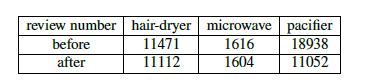

## Summary

* 使用到的方法或者模型全部加粗，而不是只有缩写加粗，而且在每个section第一次出现的时候都要加粗，第二次出现的时候不加粗而且尽量使用缩写；

* 第二段最后一句，应为which help；

* 最后一段a lot of 可以删除；

* 残缺的部分记得及时找我或者王同学要。

## Introduction

### Problem Background

* 第一段第一句refer的时态有问题，published改为are published?

* 第二段第二句stars应该为star ratings；

* 不太理解第二段最后一句commentators and commentators 是什么意思。

### Our Work

* 第三段第二句change trend 是否改为 trend;

* 第三段最后一句 is stronger than that of microwave oven and stronger than that of pacifier是否改为is stronger than that of microwave oven and pacifier;

* 流程图上面的Type *Markdown* and LaTeX: $\alpha ^2$ 和下面的Text is not SVG - cannot display 删一下

## Reasonable Assumption

* data cleansing and data mining 单独划分到一个Section **Data Process and Insight**;

* Tabel 1 和 Table 3的图表用以下的形式：

* 2.2 的第一段的over time删除；

* 所有的Figure and Table 记得加粗；

* 第二段第一句Figure 2,3,4改为Figure 3；

* 第二段最后一句话改为The bigger the size of word , the higher the word frequency.

* 像Figure 4这种把pdf放缩到100%也看不清文字的情况建议把两个图放一行，然后把另一个图放在下一行会清晰一些。

## Problem 1

* 3.1的最后一句reduced改为deprioritized;

* 3.2.1的第一段第三句后半段改为decisions enven if their **Pearson correlation coefficient**;

* 3.2.1第三段第二句，we are required to 改为 we are needed to;

* 公式（5）下面的注释$\theta $后面加一个is；

* 矩阵（6）上方有个小bug：determination应为$C=(c_{ij})_{n_\times m}$；

* 矩阵（6）下方有多处bug，上标或者下标不带大括号的话就只会执行第一个letter，n和m之间少了个$\times$;

* 公式（7）下面一段倒数第二句, specially within改为, e.g.,;

* 公式(10)上面的i.e.前面缺失一个逗号

## Problem 3

* 第一段第一句always applied for 之前缺少一个is.

## Problem 5

* 文章的语态除非有时间上的先后顺序一般用一般现在时，第一段第一句intended to 前面加一个are.
